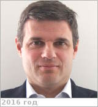

# Bruzzone, Lorenzo
> 2019.10.13 [🚀](../index/index.md) [despace](index.md) → [Contact](contact.md)

|*[Org.](contact.md)*|*Trento Univ., IT. Professor & Head of the Remote Sensing Laboratory (since 1999)*|
|:--|:--|
|B‑day, addr.|<mark>nodate</mark> 1970  / …|
|Contact|<lorenzo.bruzzone@ing.unitn.it>, *work:* <mark>noworkphone</mark>; *mobile:* <mark>nomobile</mark>|
|i18n|<mark>TBD</mark>|
|| <mark>nosign</mark> |

   - **[Education](edu.md):** PostDoc, Remote Sensing & Signal Processing, University of Genoa, Italy, 1999. PhD, Telecommunication Engineering, University of Genoa, Italy, 1998. BS, Electronic Engineering, 1993.
   - **Exp.:** Dr. Bruzzone is the founder & the director of the Remote Sensing Laboratory in the Department of Information Engineering & Computer Science, Univ. of Trento. His research interests are in the areas of remote sensing, radar & [SAR](sar.md), signal processing, machine learning & pattern recognition. Among the others, he’s currently the [Principal Investigator](principal_investigator.md) of the Radar for icy Moon exploration (RIME) instrument in the framework of the JUpiter ICy moons Explorer (JUICE) mission of the European Space Agency (ESA) & the Science Lead for the High Resolution Land Cover project in the framework of the Climate Change Initiative of ESA. He is the author (or coauthor) of 247 scientific publications in international journals (183 in IEEE journals), 310 papers in conference proceedings, 21 book chapters.
   - …
   - **SC/Equip.:** … [EnVision](envision.md)
   - **Conferences:** …
   - Git: …
   - Facebook: <mark>nofb</mark>
   - Instagram: <mark>noin</mark>
   - LinkedIn: <https://www.linkedin.com/in/lorenzo-bruzzone-043636/>
   - Twitter: <mark>notw</mark>
   - <https://www.researchgate.net/profile/Lorenzo_Bruzzone2>
   - <https://scholar.google.com/citations?:user=ff9-TK4AAAAJ&hl=en>
   - <https://rslab.disi.unitn.it/people/#LorenzoBruzzone>
   - <https://dblp.uni-trier.de/pers/hd/b/Bruzzone:Lorenzo>
   - **As a person:**
      1. …
