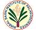

# BSIP
> 2019.08.11 [🚀](../index/index.md) [despace](index.md) → [Contact](contact.md)

||<director@bsip.res.in>, +91(522)274-00-11, Fax: +91(0522)274-04-85;  *53, University Road, Lucknow, Uttar Pradesh 226007, India*  【<http://www.bsip.res.in/> ・ [Wikipedia(EN) ⎆](https://en.wikipedia.org/wiki/Birbal_Sahni_Institute_of_Palaeobotany)】|
|:--|:--|
|**Mission**|…|
|**Vision**|…|
|**Values**|…|
|**Business**|…|
|**[MGMT](mgmt.md)**|…|

**The Birbal Sahni Institute of Palaeobotany (BSIP)** is an autonomous institute constituted under the Department of Science & Technology, Government of India. The Institute is a seat of higher learning in the field of plant fossil research; established in the 1946. The main objectives of the Institute are set as:

   - To develop palaeobotany in all its botanical & geological aspects.
   - To constantly update data for interaction with allied disciplines.
   - To co-ordinate with other palaeobotanical & geological research centres in the areas of mutual interest, such as diversification of early life, exploration of fossil fuels, vegetational dynamics, climatic modelling, conservation of forests.
   - To disseminate palaeobotanical knowledge in universities, educational institutions & other organisations.

 

…

