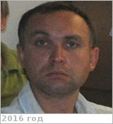

# Бурданов, Антон Владимирович
> 2019.04.01 **[🚀](../index/index.md) [despace](index.md)** → [Contact](contact.md)

|*[Org.](contact.md)*|*[ЦНИИмаш](zz_tsniimash.md), RU. Центр системного проектирования, Отдел 1322. Главный специалист отдела проектно‑поисковых исследований в обеспечение разработки программ, космических комплексов и приборного ряда для фундаментальных космических исследований*|
|:--|:--|
|i18n|<mark>TBD</mark>|
|Tel|*раб.:* +7(495)513-40-81; *mobile:* +7(926)273-80-51|
|E‑mail|<burdanovav@tsniimash.ru>|
|B‑day, addr.|1980.11.03 / …|
|| |

   - **[Education](edu.md):** …
   - **Exp.:** …
   - Паспорт: 4608 181572, выдан 06.09.2008 ТП №2 УФМС по МО г. Королёв
   - **SC/Equip.:** …
   - **Conferences:** …
   - Git: …
   - Facebook: <mark>nofb</mark>
   - Instagram: <mark>noin</mark>
   - LinkedIn: <mark>noli</mark>
   - Twitter: <mark>notw</mark>
   - <https://vk.com/id214734180>
   - **As a person:**
      1. …
