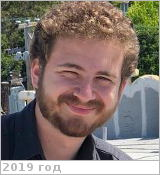

# Caro, Tristan
> 2019.07.18 ┊ **🚀 [despace](index.md)** → **[Contact](contact.md)**

|*[Org.](contact.md)*|*[Berkeley Univ.](zz_berkeley_univ.md), Koskella Lab, US. Departments of Ecology & Evolutionary Biology & Geological Sciences. Lab Technician*|
|:--|:--|
|i18n| <mark>TBD</mark> |
|Tel|*раб.:* <mark>noworkphone</mark>; *моб.:* <mark>нетмобильного</mark> |
|E‑mail| <tcaro@berkeley.edu> |
|B‑day, addr.| <mark>нетдаты</mark> / … |
||  <mark>нетподписи</mark> |

   - **[Education](edu.md):** BA, Molecular & Cell Biology, Berkeley Univ.
   - **Exp.:** …
   - …
   - **SC/Equip.:** …
   - **Conferences:** 2019 [VD Workshop 2019](vdws2019.md)
   - Git: …
   - Facebook: <mark>нетфб</mark>
   - Instagram: <mark>нетинсты</mark>
   - LinkedIn: <https://www.linkedin.com/in/tristan-caro-428542124>
   - Twitter: <mark>неттви</mark>
   - **As a person:**
      1. …
