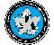

# CASI
> 2019.08.14 ┊ **[🚀](../index/index.md) [despace](index.md)** → [Contact](contact.md)

||*350 Terry Fox Dr., Suite 104 Kanata, ON, K2K 2W5, Canada*|
|:--|:--|
|E‑mail| <casi@casi.ca> |
|Link| <https://www.casi.ca/>  <https://en.wikipedia.org/wiki/Canadian_Aeronautics_and_Space_Institute>  <https://www.linkedin.com/company/canadian-aeronautics-and-space-institute/>  <https://twitter.com/CASInstitute> |
|Tel| +1(613)591-87-87, fax: +1(613)591-72-91 |

**Canadian Aeronautics & Space Institute (CASI)** is a [nonprofit organization](nonprof_org.md) for Canadians that are interested in the fields of space, aeronautics, & remote sensing. It seeks to further the cause of science & engineering among the population, & provides for networking opportunities within the aeronautics & space community in Canada. The institute is composed of 15 branches that serve around 1 600 members in major cities across the nation, with some being partially or fully sponsored by Canadian universities & colleges.  
The Canadians Aeronautics & Space Institute was formed in 1954 when the Montreal based Institute of Aircraft Technicians, the Ottawa Aeronautical Society, & the Canadian sections of the U.S. Institute of Aeronautical Sciences amalgamated to form the Canadian Aeronautical Institute (CAI).

 

## CASI, comments

CASI Vision & Mission

   - To advance the art, science, engineering & applications relating to aeronautics, space & related technologies in Canada
   - To assist Members in developing skills, exchanging information, & sharing talents in their areas of interest
   - To foster national pride & international esteem for Canada’s accomplishments in aeronautics, space & related technologies
   - To promote Canadian competence & international competitiveness in aeronautics, space & related technologies & their applications
   - To provide a focus for communications & networking for aeronautics & space communities in Canada

