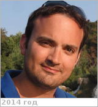

# Chalex, Remy
> 2019.04.01 ┊ **🚀 [despace](index.md)** → **[Contact](contact.md)**

|*[Org.](contact.md)*|*[ESA](zz_esa.md), CDF, EU. System Engineer в ESA, Team Leader Concurrent Design Facility в ESA, System Engineer for the ESA в Terma.*|
|:--|:--|
|i18n| <mark>TBD</mark> |
|Tel|*раб.:* <mark>нетрабочего</mark>; *моб.:* <mark>нетмобильного</mark> |
|E‑mail| <remy.chalex@esa.int> |
|B‑day, addr.| <mark>нетдаты</mark> 1979 / … |
||  <mark>нетподписи</mark> |

   - **[Education](edu.md):** …
   - **Exp.:** System Engineer active in the fields of space missions design, project management, team work & feasibility evaluation (eg. mission concept).
   - …
   - **SC/Equip.:** …
   - **Conferences:** …
   - Git: …
   - Facebook: <https://www.facebook.com/remy.chalex>
   - Instagram: <mark>нетинсты</mark>
   - LinkedIn: <http://nl.linkedin.com/in/chalex>
   - Twitter: <http://twitter.com/eurospacedude>
   - **As a person:**
      1. …
