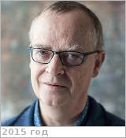

# Chassefière, Eric
> 2019.10.16 ┊ **[🚀](../index/index.md) [despace](index.md)** → [Contact](contact.md)

|*[Org.](contact.md)*|*University of Paris-Sud at Orsay, FR. IDES laboratory (Interaction & Dynamics of Surface Environments). Director*|
|:--|:--|
|i18n| <mark>TBD</mark> |
|Tel| *work:* +33(169)156-748; *mobile:* +33(169)154-911 |
|E‑mail| <eric.chassefiere@u-psud.fr> |
|B‑day, addr.| <mark>nodate</mark> 1956 Montpellier, FR / … |
||  <mark>nosign</mark>  |

   - **[CV](f/contact/c/chassefiere_001_cv.jpg)**. Doctorant, puis post‑doctorant au Service d’Aéronomie (SA), 1988.
   - **Exp.:** He is specialized in the study of Earth & planetary surfaces & subsurfaces. He has been the [principal investigator](principal_investigator.md) of the UV spectrometer to be flown on the BepiColombo mission, & co‑investigator of numerous experiments flown on Phobos, Huygens, Mars Express & Venus Express. His research activities encompass studies of the interplanetary medium & planetary atmospheres.
   - …
   - **SC/Equip.:** 2018 [BepiColombo](bepicolombo.md), 2007 [Venus Flagship Mission](venus_flagship_mission.md), 2005 [Venus Express](venus_express.md), 1997 [Cassini Huygens](cassini_huygens.md)
   - **Conferences:** …
   - Git: …
   - Facebook: <https://www.facebook.com/eric.chassefiere.9>
   - Instagram: <mark>noin</mark>
   - LinkedIn: <https://www.linkedin.com/in/eric-chassefi%C3 %A8re-5b8a5548/>
   - Twitter: <mark>notw</mark>
   - <http://www.editionsalcyone.fr/425299709>
   - <http://geops.geol.u-psud.fr/spip.php?article698&lang=fr>
   - <https://sci.esa.int/web/mars-express/-/49531-eric-chassefi-egrave-re>
   - **As a person:**
      1. …
