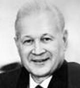

# Челомей, Владимир Николаевич
> 2019.11.17 **[🚀](../index/index.md) [despace](index.md)** → [Contact](contact.md)

|*[Org.](contact.md)*|*ЦИАМ, ОКБ-51, SU.*|
|:--|:--|
|i18n|<mark>TBD</mark>|
|Tel||
|E‑mail||
|B‑day, addr.|1914.06.30 ‑ 1984.12.08 / …|
|||

   - **[Education](edu.md):** …
   - **Exp.:** Участвовал в создании ряда двигателей и прочих важнейших объектов ракетной, космической и авиационной техники. Под его руководством были разработаны ракеты‑носители («Протон» активно используется до сих пор), искусственные спутники Земли «Протон» и «Полёт», орбитальные станции серии «Алмаз», пилотируемый корабль ТКС и т. п. Являлся одним из ключевых создателей советского «ядерного щита». Однако же, один из крупнейших проектов учёного — интегрированный оборонно‑наступательный океаническо‑сухопутно‑космический комплекс — не был реализован и остался невостребованным советской и российской оборонной промышленностью. Основные научные труды по конструкции и динамике машин, теории колебаний, динамической устойчивости упругих систем, теории сервомеханизмов. Посмертно академик В. Н. Челомей в 1986 г. признан соавтором открытия (вместе с д.т. н. О. Н. Кудриным и А. В. Квасниковым) «Явления аномально высокого прироста тяги в газовом эжекционном процессе с пульсирующей активной струей». Открытие зарегистрировано в Государственном реестре открытий СССР под номером 314.
   - Конструктор ракетно‑космической техники и учёный в области механики и процессов управления, академик АН СССР (1962). Дважды Герой Социалистического Труда (1959, 1963). Лауреат Ленинской премии и трёх Государственных премий СССР. ┊ Фактически возглавлял Совет главных конструкторов в 1961 ‑ 1964 гг.
   - **SC/Equip.:** …
   - **Conferences:** …
   - Git: …
   - Facebook: 
   - Instagram: 
   - LinkedIn: 
   - Twitter: 
   - <https://ru.wikipedia.org/wiki/Челомей,_Владимир_Николаевич>
