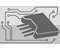

# ЦКБ ИУС
> 2019.08.06 ┊ **[🚀](../index/index.md) [despace](index.md)** → [Contact](contact.md)

||*Россия, 124460, Москва, Зеленоград, Георгиевский проспект, д. 5.  Почтовый — Россия, 124460, Москва, Зеленоград, а/я 141.*|
|:--|:--|
|E‑mail| <ics@ckbius.ru> |
|Link| <http://ckbius.ru/> |
|Tel| +7(499)710-41-00, fax: +7(499)731-02-89 |

**Акционерное Общество «Центральное Конструкторское Бюро Информационно‑Управляющих Систем» (АО «ЦКБ ИУС»)**. Основным видом деятельности являются разработки в области создания и изготовления информационно‑управляющих систем, микро‑ и радиоэлектронной аппаратуры для космических аппаратов и военной техники.

Компания ведёт полный комплекс работ — от формирования технического задания, разработки конструкторской и технической документации до изготовления опытных образцов и проведения полного состава испытаний (автономные предварительные испытания, приёмо‑сдаточные испытания и т.д.) Помимо разработки спецтехники, предприятие ведёт разработки продукции для различных отраслей промышленности и народного хозяйства, в том числе и медицины. Всю работу предприятие ведёт согласно системе менеджмента качества.  
Работу выполняет коллектив предприятия, имеющий в своём составе высококвалифицированную команду разработчиков, конструкторов и технологов. Высокую эффективность работы обеспечивает Учёный Совет предприятия, состоящий из сотрудников, имеющих большой научный опыт и длительный стаж работы в научных организациях и являющихся Главными конструкторами по направлениям. Системы автоматизированного проектирования, внедренные на предприятии, позволяют в короткие сроки проводить разработку с широким использованием прогрессивных технологий микроэлектроники.

 

## ЦКБ ИУС, comments

…
