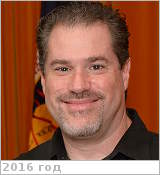

# Colaprete, Anthony
> 2019.10.15 ┊ **[🚀](../index/index.md) [despace](index.md)** → **[Contact](contact.md)**

|*[Org.](contact.md)*|*[ARC](zz_arc.md), US. Planetary Scientist*|
|:--|:--|
|i18n| <mark>TBD</mark> |
|Tel| *work:* <mark>noworkphone</mark>; *mobile:* <mark>nomobile</mark> |
|E‑mail| <Anthony.Colaprete-1@nasa.gov> |
|B‑day, addr.| <mark>nodate</mark> 1971 ? / … |
||  <mark>nosign</mark>  |

   - **[Education](edu.md):** PhD, Astrophysical, Planetary & Atmospheric Science, University of Colorado, 2000. MS, Astrophysical, Planetary & Atmospheric Science, University of Colorado, 1998. BA, Physics, University of Colorado, 1992.
   - **Exp.:** Mars General Circulation Modeling, Atmosphere radiative transfer, cloud physics, volatile transport & processes, instrument design, operation, flight mission design & operations. Hired as a civil servant in 2003, Colaprete split his time between fundamental scientific research & developing flight instrumentation. Colaprete has been the [Principal Investigator (PI)](principal_investigator.md) for several flight projects & instruments, including the LCROSS mission & the Lunar Atmosphere & Dust Environment Explorer (LADEE) Ultraviolet & Visible Spectrometer (UVS). Currently, he is the Project Scientist for the RP mission, PI for the Near InfraRed Volatiles Spectrometer System (NIRVSS) & leads the Ames Flight Instrument Group.
   - …
   - **SC/Equip.:** 2012 [LADEE](ladee.md), 2009 [LCROSS](lcross.md), 2007 [Venus Flagship Mission](venus_flagship_mission.md)
   - **Conferences:** …
   - Git: …
   - Facebook: <https://www.facebook.com/tony.colaprete>
   - Instagram: <mark>noin</mark>
   - LinkedIn: <https://www.linkedin.com/in/anthony-colaprete-6737a28b/>
   - Twitter: <mark>notw</mark>
   - <https://www.nasa.gov/centers/ames/research/2007/colaprete.html>
   - <https://scholar.google.com/citations?user=Ajm2yy4AAAAJ&hl=en>
   - **As a person:**
      1. …
