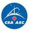

# CSA
> 2019.08.05 ┊ **[🚀](../index/index.md) [despace](index.md)** → **[Contact](contact.md)**

||*6767 Route de l'Aeroport, Saint-Hubert, Quebec, J3Y 8Y9, Canada*|
|:--|:--|
|E‑mail| <mark>noemail</mark> |
|Link| <http://www.asc-csa.gc.ca/>  <http://www.asc-csa.gc.ca/>  <https://en.wikipedia.org/wiki/Canadian_Space_Agency>  <https://ru.wikipedia.org/wiki/Канадское_космическое_агентство> |
|Tel| +1(450)926-48-00, fax: +1(450)926-43-52 |
|Etc| Миссия: The Canadian Space Agency (CSA) is responsible for advancing the knowledge of space through science; using its discoveries for the good of Canadians & all of humanity. |

**Канадское космическое агентство (ККА)** *(англ. Canadian Space Agency, CSA, фр. Agence spatiale canadienne, ASC)* — канадское правительственное космическое агентство ответственное за канадскую космическую программу. Агентство было основано соответствующим актом о канадском космическом агентстве (Canadian Space Agency Act). Руководителем предприятия является президент, который отчитывается непосредственно министру промышленности. Основано 1 марта 1989 года.  
Головной офис ККА находится в космическом центре Джона Чепмэна, расположенном в городке Сен‑Хуберт (Квебек). Ещё имеется офис агентства в Оттаве в лаборатории имени Дэвида Флориды, а также есть несколько отделов связи в Вашингтоне, Париже, Мысе Канаверал и Хьюстоне. The CSA has approximately **670 employees**. Nearly 90 % of its personnel work at its headquarters, the John H. Chapman Space Centre, located in Saint-Hubert, Quebec. The other staff members work out of the Gatineau office & the David Florida Laboratory, as well as in Houston, Washington & Paris.  

The CSA focuses its activities & resources on three main areas:

   1. Space exploration: Participation in astronaut missions, astronomy & planetary studies, scientific research in space (execution & support).
   1. Space utilization: Earth observation by satellite & collection of space data.
   1. Space science & technology: Development of innovative space technologies & applications used on Earth.

 

## CSA, comments

**Организационная структура:**

   - **President**
      - **Vice-President**
      - **Audit & Evaluation**
      - **Communication & Public Affairs**
      - **Programs & integrated planning**
      - **Finance**
      - **Policy**
         - International & Regulatory Affairs
         - Strategic Policy & Domestic Affairs
         - Special Projects
      - **Corporate Services**
         - Security & Facilities
         - Information Management & Information Technology
      - **Human Resources**
      - **Space Exploration**
         - Space Exploration Development
         - Space Exploration Operations & Infrastructure
         - Astronauts, Life Science & Space Medicine
         - Space Exploration Strategic Planning
      - **Space Science & Technology**
         - Innovation Planning & Commercialization
         - Technology & Science Development
         - Engineering & Capability Demonstration
         - David Florida Laboratory (DFL)
      - **Space Utilization**
         - Projects
         - Development
         - Satellite Operations, Infrastructure & Applications
