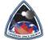

# CSS
> 2019.08.13 ┊ **[🚀](../index/index.md) [despace](index.md)** → **[Contact](contact.md)**

||*P.O. Box 19015, 360-A Bloor Street West, Toronto, Ontario, M5S 1X0, Canada*|
|:--|:--|
|E‑mail| <general@css.ca> |
|Link| <https://css.ca/>  <https://www.facebook.com/CanadianSpaceSociety/>  <https://ca.linkedin.com/company/canadian-space-society>  <https://twitter.com/cdnspacesociety> |
|Tel| +1(416)836-320-54, fax: … |
|Etc| … |

**Canadian Space Society (CSS)**. Founded in 1983, the Canadian Space Society (CSS) has been a federally-incorporated [non-profit organization](nonprof_org.md) & charity. With many of Canada’s top space professionals on board, the CSS is made up of enthusiasts of all backgrounds pursuing the exploration & development of the Solar System & beyond.  
Inspired by the old L5 Society & other space-activist groups, its principal objective is to sponsor & promote the involvement of Canadians in the space sector, through its technical & outreach projects including regular chapter meetings, the annual Canadian Space Summit & more.  
The CSS wishes to grow in cooperation, rather than in competition, with other space development organizations (such as the National Space Society & the British Interplanetary Society), while meeting a real need for an effective Canadian space advocacy group.

 

## CSS, comments

**Our Mission:**

   - **Inform.** We inform our membership & the public about Canada’s activities in space within the context of the broader international community.
   - **Educate.** We educate on space exploration, discovery, innovation & its values.
   - **Engage.** We engage our members through space related projects, activities, & networking opportunities.
   - **Shape.** We shape space policy, representing our membership & the public through activities that bring together members of government, academia, & business.

**Our Vision:**  
To lead Canada in the effective cooperation between industry, government, academia, advocacy groups, & the public for the advancement of space endeavours.

**Canada’s Annual Space Industry Conference**  
The Canadian Space Society’s Annual Space Summit is Canada’s leading conference devoted to space science, research & technology. With an annual attendance of approximately 150 attendees (and growing), the Summit brings together space professionals from industry, academia, government & the military as well as enthusiasts from all walks of life. The Canadian Space Summit is THE place to learn about the latest trends, technologies & political issues taking place in the space industry. With technical sessions on everything from astronomy to Earth orbit, from life sciences to law & policy, the Canadian Space Summit touches upon every facet affecting Canada’s space industry!
