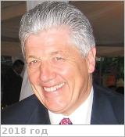

# Cutts, James Alfred
> 2019.07.07 ┊ **🚀 [despace](index.md)** → **[Contact](contact.md)**

|*[Org.](contact.md)*|*[JPL](zz_jpl.md), US. Solar System Exploration Directorate, Program Manager*|
|:--|:--|
|i18n| <mark>TBD</mark> |
|Tel|*раб.:* +1(818)354-41-20; *моб.:* <mark>нетмобильного</mark> |
|E‑mail| <James.A.Cutts@jpl.nasa.gov> |
|B‑day, addr.| <mark>нетдаты</mark> 1945 ? / Pasadena, California, USA |
||   |

   - **[Education](edu.md):** MS (Geophysics) & PhD, Caltech, 1972, Planetary Science. BA in Physics from Cambridge University.
   - **Exp.:** Responsible for the development & demonstration of advanced concepts for solar system exploration. A major focus — planetary aerobots or robotic balloons. He was Manager of the Planetary Science Institute of Science Applications International Corporation & a scientific investigator with the Mariner 9 & Viking Orbiter Imaging teams. He was Program Manager for Advanced Concepts & Deputy Director of the Center for Space Microelectronics Technology (1988 ‑ 1991). He has served as Chair of NASA’s Sensor Working Group (1988 ‑ 1990) & has served on other NASA & U.S. Air Force advisory committees. He has authored ~50 papers in planetary science, sensor technology & innovative space missions concepts.
   - …
   - **SC/Equip.:** 2007 [Venus Flagship Mission](venus_flagship_mission.md)
   - **Conferences:** 2019 [VEXAG 17](vexag_2019.md), 2019 [IVC](ivc_2019.md)
   - Git: …
   - Facebook: <http://www.facebook.com/jajcutts>
   - Instagram: <mark>нетинсты</mark>
   - LinkedIn: <https://www.linkedin.com/in/jim-cutts-33974011/>
   - Twitter: <mark>неттви</mark>
   - <https://vfm.jpl.nasa.gov/peoplevfm/>
   - <https://www.researchgate.net/profile/James_Cutts>
   - <https://jpl-nasa.academia.edu/JamesCutts>
   - **As a person:**
      1. …
