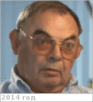

# Долгополов, Владимир Павлович
> 2019.11.16 ┊ **[🚀](../index/index.md) [despace](index.md)** → **[Contact](contact.md)**

|*[Org.](contact.md)*|*НПОЛ, RU. 9/301. Отдел 512 «Проектно‑конструкторский». Ведущий специалист*|
|:--|:--|
|i18n| Dolgopolov, Vladimir Pavlovich |
|Tel| *work:* 31-35; *mobile:* +7(903)775-55-56 |
|E‑mail| <mark>noemail</mark> |
|B‑day, addr.| 1939.03.16, на НПОЛ с 1968 / … |
||   |

   - **[Education](edu.md):** …
   - **Exp.:** С 2017.05.05 ведущий специалист отдела 512 в составе группы «Лунатиков» *(позывной — «Профессор Звёздочкин»)*. До 2017.05.05 ведущий специалист Дирекции 202.
   - Имеет интересную особенность организма — может плавно уснуть на пару минут, если не занят активным делом, и так же плавно проснуться. ┊ Знаком с [Kerry Nock](zz_nock1.md).
   - **SC/Equip.:** … [Луна‑27](луна_27.md), … [Луна‑25](луна_25.md), 1984 [Вега‑1/2](vega_1_2.md), (1983) [Венера‑15/16](venera_15_16.md), (1981) [Венера‑13/14](venera_13_14.md), (1978) [Венера‑11/12](venera_11_12.md), 1976 [Луна‑24](луна_24.md), (1975) [Венера‑9/10](venera_9_10.md), (1972) [Венера‑8](venera_8.md), (1970) [Венера‑7](venera_7.md), (1969) [Венера‑5/6](venera_5_6.md), 1966 [Луна‑9](луна_9.md), (1965) [Венера‑3](venera_2_3.md)
   - **Conferences:** …
   - Git: …
   - Facebook: <mark>nofb</mark>
   - Instagram: <mark>noin</mark>
   - LinkedIn: <mark>noli</mark>
   - Twitter: <mark>notw</mark>
   - **As a person:**
      1. …
