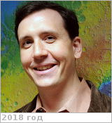

# Domagal-Goldman, Shawn
> 2019.07.17 **[🚀](../index/index.md) [despace](index.md)** → [Contact](contact.md)

|*[Org.](contact.md)*|*[NASA](zz_nasa.md) [GSFC](zz_gsfc.md), US. Planetary Systems Laboratory, Planetary Science Division, Science & Exploration Directorate. Lab head, Research Space Scientist*|
|:--|:--|
|i18n|<mark>TBD</mark>|
|Tel|*раб.:* +1(301)614-62-45; *mobile:* <mark>nomobile</mark>|
|E‑mail|<shawn.goldman@nasa.gov>|
|B‑day, addr.|<mark>nodate</mark> / …|
|| <mark>nosign</mark>|

   - **[Education](edu.md):** PhD in Geosciences & Astrobiology.
   - **Exp.:** Research interests: Exoplanets, Archean geochemistry, planetary atmospheres, astrobiology. My research focuses on ascertaining as much as possible about «alien planets» using sparse data sets. For early Earth & other terrestrial planets, I work on utilizing isotopic trends as proxies for atmospheric processes & elemental cycling. This includes work on the fundamental controls on Fe isotope fractionation & on global controls on mass‑independent Sulfur isotope fractionation (S‑MIF). For extrasolar planets, I help develop spectroscopy‑based characterization techniques that can inform us about a planet’s surface climate, habitability, & ecosystems. I'm also extremely passionate about science communication, & believe it is our responsibility as publicly‑funded scientists to bring the results of our research back to the public. To this end, I’ve helped organize FameLab events in the US… & am always looking for new opportunities to talk about NASA science in public forums.
   - …
   - **SC/Equip.:** …
   - **Conferences:** 2019 [VD Workshop 2019](vdws2019.md)
   - Git: …
   - Facebook: <https://www.facebook.com/shawndgoldman>
   - Instagram: <mark>noin</mark>
   - LinkedIn: <https://www.linkedin.com/in/shawn-domagal-goldman-42a6a39>
   - Twitter: <mark>notw</mark>
   - <https://en.wikipedia.org/wiki/Shawn_Domagal-Goldman>
   - <https://science.gsfc.nasa.gov/sed/bio/shawn.goldman>
   - <https://carnegiescience.edu/otherearths>
   - <https://www.researchgate.net/profile/Shawn_Domagal-Goldman>
   - <https://scholar.google.com/citations?user=Yh6HcGwAAAAJ&hl=en>
   - **As a person:**
      1. …
