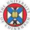

# Edinburgh Univ.
> 2019.08.09 ┊ **🚀 [despace](index.md)** → **[Contact](contact.md)**

||*WRV6+R8 Edinburgh, UK*|
|:--|:--|
|E‑mail| <mark>noemail</mark> |
|Link| <https://www.ed.ac.uk/>  <https://en.wikipedia.org/wiki/University_of_Edinburgh>  <https://ru.wikipedia.org/wiki/Эдинбургский_университет> |
|Tel| +44(131)650-1000, fax: … |
|Etc| … |

**Эдинбургский университет (The University of Edinburgh (abbreviated as Edin.)** — государственный университет в столице Шотландии городе Эдинбурге. Шестой по старшинству в Великобритании, открылся в 1583 году. Ему принадлежат многие здания в старой части города. Структурно состоит из трёх колледжей, включающих 20 школ. Член группы «Расселл» и Лиги европейских исследовательских университетов.

**Опыт кооперации.**  
…

 

## Edinburgh Univ., comments

…

