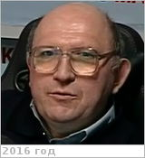

# Ёлкин, Константин Сергеевич
> 2019.04.01 ┊ **🚀 [despace](index.md)** → **[Contact](contact.md)**

|*[Org.](contact.md)*|*[ЦНИИмаш](zz_tsniimash.md), RU. Центр системного проектирования. Заместитель начальника отделения*|
|:--|:--|
|i18n| <mark>TBD</mark> |
|Tel|*раб.:* +7(495)513-56-90, секретарь: +7(495)513-42-92; *моб.:* +7(926)601-82-41 |
|E‑mail| <elkin@tsniimash.ru>, <elkin_konst@mail.ru> |
|B‑day, addr.| 1960.06.02 / … |
||   |

   - **[Education](edu.md):** МГУ
   - **Exp.:** …
   - …
   - **SC/Equip.:** …
   - **Conferences:** …
   - Git: …
   - Facebook: <https://www.facebook.com/elkin.konst>
   - Instagram: <mark>нетинсты</mark>
   - LinkedIn: <mark>нетин</mark>
   - Twitter: <mark>неттви</mark>
   - **As a person:**
      1. …
