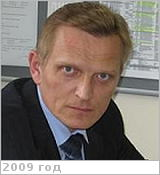

# Елшанский, Леонид Борисович
> 2019.04.01 [🚀](../index/index.md) [despace](index.md) → [Contact](contact.md)

|*[Org.](contact.md)*|*[Роскосмос](zz_roskosmos.md), RU. Консультант*|
|:--|:--|
|B‑day, addr.|<mark>nodate</mark> / …|
|Contact|<elshanskiy.lb@roscosmos.ru>, *раб.:* +7(495)631-91-22; *mobile:* <mark>nomobile</mark>|
|i18n|<mark>TBD</mark>|
| | <mark>nosign</mark>|

   - **[Education](edu.md):** …
   - **Exp.:** …
   - …
   - **SC/Equip.:** …
   - **Conferences:** …
   - Git: …
   - Facebook: <https://www.facebook.com/profile.php?:id=100004568714766>
   - Instagram: <mark>noin</mark>
   - LinkedIn: <mark>noli</mark>
   - Twitter: <mark>notw</mark>
   - <https://ok.ru/profile/344026053>
   - **As a person:**
      1. Бывший военный — хочет всегда знать что, почему, где и как. Со своей стороны же старается не давать информации.
