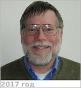

# Esposito, Larry W.
> 2019.04.01 ┊ **🚀 [despace](index.md)** → **[Contact](contact.md)**

|*[Org.](contact.md)*|*[LASP](zz_lasp.md), US. Professor, Astrophysical & Planetary Sciences. [Principal Investigator](principal_investigator.md), UVIS Instrument on the Cassini Mission to Saturn*|
|:--|:--|
|i18n| <mark>TBD</mark> |
|Tel|*раб.:* +1(303)492-73-25; *моб.:* <mark>нетмобильного</mark> |
|E‑mail| <larry.esposito@lasp.colorado.edu> |
|B‑day, addr.| 1951.04.15 / … |
||  <mark>нетподписи</mark> |

   - **[Education](edu.md):** A 1973 graduate at the Massachusetts Institute of Technology. PhD in astronomy.
   - **Exp.:** Observational & theoretical studies of planetary atmospheres & rings; chemistry & dynamics of Venus clouds; waves in Saturn’s rings; numerical methods for radiation transfer.
   - …
   - **SC/Equip.:** …
   - **Conferences:** 2019 [VD Workshop 2019](vdws2019.md), 2019 [IVC](ivc_2019.md)
   - Git: …
   - Facebook: <https://www.facebook.com/larry.esposito.503>
   - Instagram: <mark>нетинсты</mark>
   - LinkedIn: <mark>нетин</mark>
   - Twitter: <mark>неттви</mark>
   - <https://en.wikipedia.org/wiki/Larry_W._Esposito>
   - <http://lasp.colorado.edu/~esposito/>
   - <https://www.colorado.edu/aps/larry-esposito>
   - **As a person:**
      1. …
