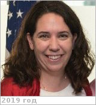

# Ewan, Shannon
> 2019.07.14 ┊ **[🚀](../index/index.md) [despace](index.md)** → [Contact](contact.md)

|*[Org.](contact.md)*|*[NASA](zz_nasa.md), US. International Program Specialist*|
|:--|:--|
|i18n| <mark>TBD</mark> |
|Tel|*раб.:* <mark>noworkphone</mark>; *mobile:* <mark>nomobile</mark> |
|E‑mail| <mark>noemail</mark> |
|B‑day, addr.| <mark>nodate</mark> 1982 / Washington |
||  <mark>nosign</mark> |

   - **[Education](edu.md):** MA, International Relations & International Economics, Concentration: International Energy Policy, J.Hopkins Univ., 2009. BA, Political Science/French, Notre Dame Univ., 2003. Proficient in Russia, fluent in French. Russian language immersion at Moscow State University in January 2009.
   - **Exp.:** Specialties: Plutonium disposition, MOX fuel, HEU downblending, fissile material disposition, nuclear & radiological security, physical security, nuclear nonproliferation, federal budgeting, project management, energy security, U.S. energy policy, international science cooperation, EU-Russian energy relations, legislative process.
   - …
   - **SC/Equip.:** …
   - **Conferences:** 2019 [IVC](ivc_2019.md)
   - Git: …
   - Facebook: <https://www.facebook.com/shannon.ewan.5>
   - Instagram: <mark>noin</mark>
   - LinkedIn: <https://www.linkedin.com/in/shannon-ewan-aa44261/>
   - Twitter: <mark>notw</mark>
   - **As a person:**
      1. …
