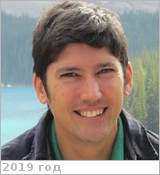

# Ghail, Richard
> 2019.10.12 **[🚀](../index/index.md) [despace](index.md)** → [Contact](contact.md)

|*[Org.](contact.md)*|*Imperial College London / Royal Holloway, University of London, UK. Department of Earth Sciences. Reader*|
|:--|:--|
|i18n| <mark>TBD</mark> |
|Tel| *work:* +44(1784)27-67-66; *mobile:* <mark>nomobile</mark> |
|E‑mail| <Richard.Ghail@rhul.ac.uk> |
|B‑day, addr.| <mark>nodate</mark> 1970 ? / … |
||  <mark>nosign</mark>  |

   - **[Education](edu.md):** …
   - **Exp.:** As a Reader in Planetary & Engineering Geology I am interested in most areas of geology, but principally my research has been on tectonic processes away from plate boundaries, on continental areas of Earth, particularly the London Basin, & on Venus, where the lack of erosion means that these processes are more clearly discernible. I have worked with synthetic aperture radar ([SAR](sar.md)) data for more than 25 years & understand its strangeness as an imaging system, & the use of phase information for change detection. For the first time we now have a tool that can measure the mm/yr rate of horizontal & vertical movement characteristic of low seismicity continental interiors. I am applying these techniques to help predict ground engineering problems & groundwater flow, & am developing new tools using the full amplitude, phase & polarimetric components of SAR data. The London Basin appears to be modestly active at present but poorly understood, posing significant hazards to both the deeper (e.g., Crossrail) & older (e.g., the Northern Line) parts of London’s infrastructure. Of particular concern is the presence of local anoxic air pockets underground caused by cavitation & reduction by green rust during dewatering, & then trapped by rising groundwater in fault-bounded blocks. Understanding their origin & location is the subject of ongoing research with the Tideway Thames Tunnel project. I am lead proposer of EnVision, an ambitious European Medium Class mission to detect & measure the rates of internal, surface & atmospheric changes on Venus, using the most advanced Earth Observation SAR technology & experience. These new data are essential to understanding volcanic, tectonic & atmospheric processes on Venus & ultimately to explaining why a planet so similar to Earth has evolved so differently.
   - …
   - **SC/Equip.:** … [EnVision](envision.md)
   - **Conferences:** …
   - Git: …
   - Facebook: <https://www.facebook.com/rich.ghail>
   - Instagram: <mark>noin</mark>
   - LinkedIn: <https://www.linkedin.com/in/richard-ghail/>
   - Twitter: <mark>notw</mark>
   - <https://www.researchgate.net/profile/Richard_Ghail>
   - <https://pure.royalholloway.ac.uk/portal/en/persons/richard-ghail(a2ddf183-a73b-473b-af37-9532b6063b6f).html>
   - **As a person:**
      1. …
