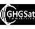

# GHGSat
> 2019.08.29 **[🚀](../index/index.md) [despace](index.md)** → [Contact](contact.md)

||*3981 St Laurent Blvd Suite 500, Montreal, QC H2W 1Y5, Canada*|
|:--|:--|
|E‑mail| <mark>noemail</mark> |
|Link| <https://www.ghgsat.com/> |
|Tel| +1(514)847-94-74, ℻: … |

**GHGSat** provides global emissions monitoring services, currently for greenhouse gases & ultimately also for air quality & other trace gases from a wide range of sources.  
GHGSat’s mission is to become the global reference for remote sensing of greenhouse gas (GHG), air quality gas, & other trace gas emissions from any source in the world. GHGSat is currently operating a high‑resolution demonstration satellite. New, high‑resolution satellite & very‑high resolution aircraft platforms are being built for operation starting in spring/summer of 2019.

 

## GHGSat, comments

**What we do.**  
You give us the geographic copordinates of any site in the world, & we will task our platforms (satellite or aircraft) to measure gas concentrations at the site, within days of your request. We then use these & other data to deliver unique analysis of the site, such as emission rates, trends, & leak alerts.
