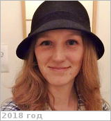

# Gray, Candace L.
> 2019.07.13 **[🚀](../index/index.md) [despace](index.md)** → [Contact](contact.md)

|*[Org.](contact.md)*|*[New Mexico Univ.](nmexico_univ.md) / [Apache Obs.](apache_obs.md), US. Department of Astronomy. Support Astronomer.*|
|:--|:--|
|i18n|<mark>TBD</mark>|
|Tel|*раб.:* <mark>noworkphone</mark>; *mobile:* <mark>nomobile</mark>|
|E‑mail|<candaceg@nmsu.edu>|
|B‑day, addr.|<mark>nodate</mark> 1980 / …|
|| <mark>nosign</mark>|

   - **[Education](edu.md):** PhD, Astronomy, New Mexico Univ., 2015.
   - **Exp.:** …
   - …
   - **SC/Equip.:** …
   - **Conferences:** 2019 [VEXAG 17](vexag_2019.md)
   - Git: …
   - Facebook: <https://www.facebook.com/candace.gray.5667>
   - Instagram: <mark>noin</mark>
   - LinkedIn: <https://www.linkedin.com/in/candace-gray-626577b5/>
   - Twitter: <https://twitter.com/aredheadofvenus>
   - <https://www.researchgate.net/profile/Candace_Gray2>
   - <https://www.lpi.usra.edu/vexag/interview_series/index.shtml#gray>
   - **As a person:**
      1. …
