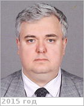

# Хайлов, Михаил Николаевич
> 2019.04.01 ┊ **🚀 [despace](index.md)** → **[Contact](contact.md)**

|*[Org.](contact.md)*|*[Роскосмос](zz_roskosmos.md), RU. Заместитель ген. директора по автоматическим космическим комплексам и системам Госкорпорации «Роскосмос»*|
|:--|:--|
|i18n| <mark>TBD</mark> |
|Tel|*раб.:* …, секретарь: +7(495)631-93-95, fax: +7(495)631-89-93; *моб.:* +7(916)158-02-32, +7(916)170-34-11 |
|E‑mail| <mark>нетпочты</mark> |
|B‑day, addr.| 1973.07.07, в Роскосмосе с 2008 / … |
||   |

   - **[Education](edu.md):** M.S., Космические летательные аппараты и разгонные блоки, МАИ, РФ, 1996.
   - **SC/Equip.:** …
   - …
   - **Conferences:** …
   - Git: …
   - Facebook: <mark>нетфб</mark>
   - Instagram: <mark>нетинсты</mark>
   - LinkedIn: <mark>нетин</mark>
   - Twitter: <mark>неттви</mark>
   - <http://www.federalspace.ru/120/>
   - **As a person:**
      1. …
