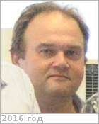

# Хатунцев, Игорь Валерьевич
> 2019.04.01 **[🚀](../index/index.md) [despace](index.md)** → [Contact](contact.md)

|*[Org.](contact.md)*|*[ИКИ РАН](zz_iki_ras.md), RU. Отдел № 53 «Физики планет и малых тел солнечной системы». Лаб. № 531 «Спектроскопии планетных атмосфер». Старший научный сотрудник*|
|:--|:--|
|B‑day, addr.|<mark>nodate</mark> / …|
|E‑mail|<khatuntsev@gmail.com>|
|i18n|<mark>TBD</mark>|
|Tel|*work:* <mark>noworkphone</mark>; *mobile:* +7(495)333-41-02|
|| <mark>nosign</mark> |

   - **[Education](edu.md):** …
   - **Exp.:** …
   - …
   - **SC/Equip.:** …
   - **Conferences:** …
   - Git: …
   - Facebook: <mark>nofb</mark>
   - Instagram: <mark>noin</mark>
   - LinkedIn: <mark>noli</mark>
   - Twitter: <mark>notw</mark>
   - <http://www.planetary-department-iki.ru/labs/labs531.html>
   - **As a person:**
      1. …
