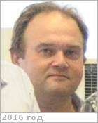

# Хатунцев, Игорь Валерьевич
> 2019.04.01 ┊ **🚀 [despace](index.md)** → **[Contact](contact.md)**

|*[Org.](contact.md)*|*[ИКИ РАН](zz_iki_ras.md), RU. Отдел № 53 «Физики планет и малых тел солнечной системы». Лаб. № 531 «Спектроскопии планетных атмосфер». Старший научный сотрудник*|
|:--|:--|
|B‑day, addr.| <mark>нетдаты</mark> / … |
|E‑mail| <khatuntsev@gmail.com> |
|i18n| <mark>TBD</mark> |
|Tel| *раб.:* <mark>нетрабочего</mark>; *моб.:* +7(495)333-41-02 |
||  <mark>нетподписи</mark>  |

   - **[Education](edu.md):** …
   - **Exp.:** …
   - …
   - **SC/Equip.:** …
   - **Conferences:** …
   - Git: …
   - Facebook: <mark>нетфб</mark>
   - Instagram: <mark>нетинсты</mark>
   - LinkedIn: <mark>нетин</mark>
   - Twitter: <mark>неттви</mark>
   - <http://www.planetary-department-iki.ru/labs/labs531.html>
   - **As a person:**
      1. …
