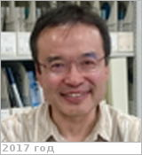

# Hayashi, Yoshi-Yuki
> 2019.07.10 **[🚀](../index/index.md) [despace](index.md)** → [Contact](contact.md)

|*[Org.](contact.md)*|*[Kobe Univ.](kobe_univ.md), JP. Graduate School of Science & Center for Planetary Science, Faculty of Science. Professor*|
|:--|:--|
|i18n| <mark>TBD</mark> |
|Tel|*раб.:* +81(78)803-64-83, fax: +81(78)803-57-91; *mobile:* <mark>nomobile</mark> |
|E‑mail| <shosuke@gfd-dennou.org>, <shosuke@ruby.kobe-u.ac.jp>, <shosuke@cps-jp.org> |
|B‑day, addr.| <mark>nodate</mark> / … |
||  <mark>nosign</mark> |

   - **[Education](edu.md):** …
   - **Exp.:** Research Interests. Geophysical fluid dynamics; wave & shear instability, dry and/or moist convection, rotating turbulence. Structures of planetary atmospheres; thermal structures, convection & general circulations of the atmospheres. Computation & information meteorology; development of simulation models for geophysical fluids & planetary atmospheres, development of analysis & visualization tools for multidimensional numerical data.
   - …
   - **SC/Equip.:** …
   - **Conferences:** …
   - Git: …
   - Facebook: <mark>nofb</mark>
   - Instagram: <mark>noin</mark>
   - LinkedIn: <mark>noli</mark>
   - Twitter: <mark>notw</mark>
   - <https://scholar.google.co.uk/citations?user=nKbOLbQAAAAJ&hl=en>
   - <http://www.gfd-dennou.org/member/shosuke/index.html.en>
   - **As a person:**
      1. …
