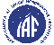

# IAF
> 2020.01.23 **[🚀](../index/index.md) [despace](index.md)** → [Contact](contact.md)

||*100 Avenue de Suffren, 75015 Paris, France*|
|:--|:--|
|E‑mail| <mark>noemail</mark> |
|Link| <http://www.iafastro.org/>  <https://en.wikipedia.org/wiki/International_Astronautical_Federation>  <https://ru.wikipedia.org/wiki/Международная_астронавтическая_федерация> |
|Tel| +33(145)674-260, ℻: +33(142)732-120 |

**Международная астронавтическая федерация (МАФ, Международная федерация астронавтики, англ. International Astronautical Federation, IAF)** — международная неправительственная некоммерческая научная организация, которая занимается проблемами исследования и освоения космоса в мирных целях, а также вопросами ракетной техники и космоса с правовой точки зрения. Основана в 1950 году на 1‑м Международном астронавтическом конгрессе в Париже главами 8 стран: Австрии, Аргентины, Великобритании, Дании, Испании, Франции, ФРГ, Швеции. Федерация базируется в Париже. Органом управления МАФ является Генеральная Ассамблея, собирающаяся ежегодно во время конгресса МАФ и избирающая бюро в составе президента и нескольких вице‑президентов. При МАФ созданы:

   - комитет по биоастронавтике,
   - комитет по вопросам образования,
   - Международная академия астронавтики (International Academy of Astronautics, IAA) (с 1960),
   - Международный институт космического права (International Institute of Space Law, IISL) (с 1960).

IAF partners:

   - **Non-Governmental Organizations:** International Academy of Astronautics (IAA), International Institute of Space Law (IISL), [Committee on Space Research (COSPAR)](cospar.md), Space Generation Advisory Council (SGAC);
   - **Intergovernmental Organizations:** United Nations Office for Outer Space Affairs (UNOOSA), United Nations Educational, Scientific and Cultural Organisation (UNESCO), International Telecommunication Union (ITU), World Metereological Organization (WMO), [European Space Agency (ESA)](zz_esa.md), Group on Earth Observation (GEO), Asia-Pacific Space Cooperation Organization (APSCO).

 

## IAF, comments

В задачи МАФ входят:

   - способствование развитию космонавтики в мирных целях;
   - помощь в широком распространении информации, касающейся космонавтики;
   - стимулирование и поддержка интереса широких кругов общественности к космонавтике;
   - поощрение участия в исследованиях, имеющих отношение к космонавтике через международные и национальные исследовательские институты, университеты и фирмы;
   - развитие активной деятельности в академиях, институтах и комиссиях, посвящённой исследованиям во всех областях наук, имеющих отношение к космонавтике;
   - созыв международных конгрессов, симпозиумов, коллоквиумов и других научных совещаний;
   - сотрудничество с соответствующими международными и национальными организациями во всех областях, имеющих отношение к космонавтике и мирному исследованию космоса.

The IAF’s missions:

   1. **Promoting Cooperation.** The IAF’s International Astronautical Congress & various IAF committees provide unique collaborative platforms for experts from space agencies, industry & research.
   1. **Advancing International Development.** The IAF is building a future of cooperation, development & international friendship, bringing together experts from experienced & emerging space nations alike.
   1. **Sharing Knowledge.** The Federation has many well-established channels to disseminate information within its global network & the wider space community.
   1. **Recognizing Achievements.** The Federation’s prestigious awards are presented annually to individuals & groups who have distinguished themselves in the global space community.
   1. **Preparing the Workforce of Tomorrow.** To nurture new talent, the Federation has many activities targeting students & young professionals.
   1. **Raising Awarness.** The global network of the IAF, & IAF publications, help promote the public appreciation of space activities worldwide.

Ежегодно МАФ совместно с Международной академией астронавтики и Международным институтом космического права проводят Международный конгресс астронавтики.

The largest & most well‑known IAF event is the annual [International Astronautical Congress (IAC)](iac.md), which takes place annually in September or October. The IAC features high‑level plenaries & highlight lectures, specialised young professionals' students events, IAF Global Networking Forum, & a technical programme presenting latest advances in science & exploration, applications & operations, technology, infrastructure, & space & society.

There are a variety of side events including the annual IAF Workshop with the support of the UN, which takes place during the 2 days preceding the IAC. The IAF also organizes the 'Global Conferences' series, with the:

   - Global Lunar Exploration Conference (GLUC 2010) in Beijing,
   - [Global Space Exploration Conference](glex.md) (GLEX 2012) in Washington DC,
   - Global Space Applications Conference (GLAC 2014) in Paris,
   - Global Space Innovation Conference (GLIC 2015) in Munich,
   - Global Conference on Space & the Information Society (GLIS 2016) in Geneva,
   - [Global Space Exploration Conference](glex.md) (GLEX 2017) in Beijing,
   - Global Space Applications Conference (GLAC 2018) in Montevideo,
   - Global Conference on Space for Emerging Countries (GLEC 2019) in Marrakech,
   - [Global Space Exploration Conference](glex.md) (GLEX 2020) in St. Petersburg.

