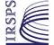

# IRSPS
> 2019.08.04 [🚀](../index/index.md) [despace](index.md) → [Contact](contact.md)

||<info@irsps.unich.it>, +39(085)453-75-12;  *IRSPS - Università "G.D'Annunzio", Viale Pindaro, 42, 65127 Pescara (PE), Italy*|
|:--|:--|
|Link|<http://www.irsps.it/>|
|**Mission**|…|
|**Vision**|…|
|**Values**|…|
|**Business**|…|
|**[Manage- ment](mgmt.md)**|…|

The **International Research School of Planetary Sciences (IRSPS)** is a [non‑profit organisation](nonprof_org.md) devoted to research & post‑graduate education. The School is an emanation of the Universita' d'Annunzio & hosted by Dipartimento di Ingegneria e Geologia (InGeo), but it is autonomously governed. IRSPS is part of the Europlanet Research Infrastructure.

The IRSPS is a small visiting institution with a limited number of untenured faculty positions, some of them provided by the Faculty of Sciences of the Universita' d'Annunzio. Many research scientists joined IRSPS for a variable amount of time as postdoctoral fellows, graduate students & senior professors. The aim of IRSPS is to constitute an enthusiastic, creative, & multi‑disciplinary gathering environment.

Planetary research mainly deals with the sub‑disciplines of geology, geochemistry, geophysics, petrology, & exobiology. However, the IRSPS is not limited to these subjects & it welcomes scientific contributions from any field of planetology. Also, the educational programs are not restricted to those fields & they will cover the entire spectrum of planetary disciplines by joint ventures & collaborations with other international institutions.

Research activities: landing sites, sedimentary geology, impact craters, icy satellites, tectonics.

 

…
