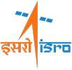

# ISRO
> 2019.08.05 [🚀](../index/index.md) [despace](index.md) → [Contact](contact.md)

||<dir.ppr@isro.gov.in>, +91(80)234-152-75 или 221-722-96, Fax: +91(80)234-122-53;  *Antariksh Bhavan, New BEL Road, Bengaluru‑560 231*|
|:--|:--|
|Link|<http://www.isro.org>  <https://en.wikipedia.org/wiki/Indian_Space_Research_Organisation>  <https://ru.wikipedia.org/wiki/Индийская_организация_космических_исследований>  <https://www.reddit.com/r/ISRO/>|
|**Mission**|…|
|**Vision**|…|
|**Values**|…|
|**Business**|…|
|**[Manage- ment](mgmt.md)**|…|

**Индийская организация космических исследований** *(хинди: भारतीय अन्तरिक्ष अनुसंधान संगठन, англ. ISRO)* — индийское национальное космическое агентство, подведомственное Департаменту космических исследований Индии. Штаб‑квартира организации находится в Бангалоре, штат составляет приблизительно 20 000 человек, годовой бюджет около 41 млрд рупий ($ 940 млн). Основана 15 августа 1969 года.

Индия имеет развитую космическую программу и в совокупности по потенциалу является в настоящее время шестой космической державой (после России, США, Китая, Европы и Японии). С запуском собственного спутника с помощью собственной ракеты‑носителя Индия в 1979 году хронологически стала седьмой космической державой. В 1980 году ISRO располагает двумя ракетами‑носителями: PSLV и GSLV. Ранее использовались две менее мощные РН: SLV и ASLV.

 

**Структура космической отрасли Индии:**

   - **Prime minister**
      - Department of space — Подразделение правительства Индии, отвечающее за управление национальной программой космических исследований. Находится под непосредственным контролем премьер-министра страны.
         - ANTRIX — Antrix corporation limited — Antrix Corporation Limited (ACL) полностью принадлежит Правительству Индии и находится под административным контролем Department of space. Необходим для коммерческого использования космической продукции ISRO, предоставления технических консультативных услуг и передачи технологий, разработанных Индийской организацией космических исследований, в промышленность.
         - IIST — Indian institure of space science and technology — Первый в Азии космический университет. Предоставляет образование в области космической науки и техники, соответствующее требованиям Индийской космической программы. Институт предлагает программы бакалавриата, магистратуры, аспирантуры и докторантуры по программам космической направленности.
         - **ISRO** — Indian space research organisation
         - NARL — National atmospheric research laboratory — Занимается разработкой технологий, наблюдениями, архивированием и моделированием данных.
Осуществляет свою исследовательскую деятельность в семи основных группах: Группа по применению и разработке радиолокаторов, Группа по исследованию ионосферы и космоса, Группа по структуре и динамике атмосферы, Группа по облачным и конвективным системам, Группа по аэрозолям, радиационным и следовым газам, Группа по исследованию погоды и климата, Группа «Компьютеры и управление данными».
         - NE-SAC — North eastern space applications centre — Объединение ДКС и Северо-восточного совета с целью развития Северо-Восточного региона с использованием космической науки и техники.
         - PRL — Physical research laboratory — ведущий научно-исследовательским институт, занимающийся фундаментальными исследованиями в областях астрономии и астрофизики, физики Солнца, науки о планетах и исследованиях, космических и атмосферных наук, геонаук, теоретической физики, атомной, молекулярной и оптической физики и астрохимии.
         - SCL — Semi-conductor laboratory — Проектирование, разработка, производство, сборка, упаковка и испытание специализированных интегральных схем, оптико-электронных устройств и устройств микроэлектромеханических систем. Лаборатория работает над созданием прочной базы микроэлектроники в стране и расширением возможностей в области сверхбольших интегральных схем.
      - Space comission

**Структура ISRO:**

   - **ISRO**
      - DECU — Development and educational communication unit — Подготовка персонала к использованию спутниковых систем связи для общественных нужд (использование спутников в образовании и медицине).
      - HSFC — Human space flight centre — Разработка средств, необходимых для пилотируемых программ.
      - IIRS — Indian institute of remote sensing — Предоставляет курсы и программы обучения в области дистанционного зондирования и геоинформатики.
      - IISU — ISRO inertial systems unit — Разработка и производство систем навигации, гироскопов, систем ориентации, акселерометров, приводов и механизмов для космических аппаратов.
      - IPRC — ISRO propulsion complex — Производство, сборка и испытания двигателей, в т. ч. с использованием криогенного топлива.
      - ISTRAC — ISRO telemetry, tracking and command network — Слежение за всеми спутниками и ракетами-носителями ISRO. Основными задачами центра являются: обеспечение выполнений миссий всех спутников дистанционного зондирования и научных спутников, предоставление услуг телеметрии, отслеживание и командование от старта ракеты-носителя до вывода спутника на орбиту, оценка точности вывода (параметров опорной орбиты).
      - ISRO Council
      - LEOS — Laboratory for electro-optics systems — Проектирование, разработка и производство электрооптических датчиков и прочего оптического оборудования для космических аппаратов.
К разрабатываемым изделиям относятся звездные датчики, солнечные датчики, магнитные датчики, оптоволоконные гироскопы, температурные датчики, камеры дистанционного зондирования, радиометры, оптические фильтры и покрытия.
      - LPSC — Liquid propulsion systems centre — Проектирование, разработка и производство ступеней с жидкостными ракетными двигательными установками для ракет-носителей ISRO.
      - MCF — Master control facility — Мониторинг и контроль всех геостационарных / геосинхронных спутников ISRO.
      - NRSC — National remote sensing centre — Отвечает за сбор и обработку спутниковых данных дистанционного зондирования, распространение данных и поддержку в области принятия решений в случае стихийных бедствий.
      - SAC — Space applications centre — Основная сфера деятельности Центра заключается в разработке космических и бортовых приборов, полезных нагрузок и их применения для целей национального развития и общественной пользы (например, навигация или дистанционное зондирование).
      - SDSC-SHAR — Satish Dhawan space centre — Производство твердотопливных ракетных блоков, проведение аттестации и испытаний различных подсистем и твердотопливных ракетных двигателей и проведения необходимых испытаний, запуск РН. Включает в себя сеть слежения и командования и центр управления полетами, две стартовые площадки, с которых проводятся операции по запуску ракет PSLV (запуск индийских спутников дистанционного зондирования на солнечно-синхронные орбиты) и GSLV (семейство одноразовых индийских ракет-носителей, предназначенных для выведения полезной нагрузки на геостационарную орбиту).
      - URSC — U R Rao satellite centre — Создание спутников и разработка спутниковых технологий в области связи, навигации, метеорологии, дистанционного зондирования, космической науки и межпланетных исследований.
      - VSSC — Vikram Sarabhai space centre — Является ведущим центром ISRO, отвечающим за проектирование и разработку технологии ракет-носителей. Центр проводит исследования и разработки в области аэронавтики, авионики, материалов, механизмов, силовых установок, космических боеприпасов, конструкций, космической физики и надежности систем.
