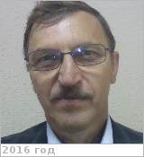

# Иванов, Сергей Вениаминович
> 2019.04.01 ┊ **[🚀](../index/index.md) [despace](index.md)** → [Contact](contact.md)

|*[Org.](contact.md)*|*НПОЛ, RU. 512 «Проектно‑конструкторский отдел». Главный специалист*|
|:--|:--|
|i18n| <mark>TBD</mark> |
|Tel| *work:* 51-41; *mobile:* +7(916)560-40-01 |
|E‑mail| <s_ivanov@laspace.ru> |
|B‑day, addr.| 1954.10.31, на НПОЛ с 1972 / … |
||   |

   - **[Education](edu.md):** …
   - **Exp.:** …
   - …
   - **SC/Equip.:** Вега‑1,2
   - **Conferences:** …
   - Git: …
   - Facebook: <mark>nofb</mark>
   - Instagram: <mark>noin</mark>
   - LinkedIn: <mark>noli</mark>
   - Twitter: <mark>notw</mark>
   - **As a person:**
      1. …
