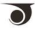

# JSASS
> 2020.07.17 **[🚀](../index/index.md) [despace](index.md)** → [Contact](contact.md)

||*4-1-21 Nihonbashi-Muromachi, Chuo-ku, Tokyo 103-0022, Japan*|
|:--|:--|
|E‑mail| <office@jsass.or.jp> |
|Link| <https://www.jsass.or.jp/> |
|Tel| <mark>noworkphone</mark>, ℻: … |

The **Japan Society for Aeronautical & Space Sciences (JSASS)** has a mission to provide the opportunity to present & report the fundamental & applied researches, exchange their knowledge, & provide the information to enhance & promote the researches in aerospace field & contribute to further advancement of academia in Japan.

Our society is in cooperation with 31 aerospace-related societies from 14 different countries, & is a representative or liaison in Japan of International Committee on Aeronautical Fatigue, International Council of the Aeronautical Sciences (ICAS), & International Union of Theoretical & Applied Mechanics. Furthermore, our society holds international activities, for example, jointly orginizing International Electric Propulsion Conference (IEPC) with AIAA & the [German Aerospace Center (DLR)](zz_dlr.md) every year.

Activities

   1. Conferences & technical tours
   1. Contract for research & investigation
   1. Issue of journals
   1. JSASS Award
   1. Recommendation of candidates to win science & technology grants
   1. Students Awards

 

## JSASS, comments

…

