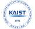

# KAIST
> 2020.07.24 [🚀](../index/index.md) [despace](index.md) → [Contact](contact.md)

||<mark>noemail</mark>, +82-42-350-2114, Fax: +82-42-350-2210(2220);  *291 Daehak-ro, Eoeun-dong, Yuseong-gu, Daejeon, Korea*|
|:--|:--|
|Link|<https://www.kaist.ac.kr/>  <https://en.wikipedia.org/wiki/KAIST>  <https://www.linkedin.com/school/한국과학기술원-kaist-/>  <https://www.linkedin.com/company/korea-advanced-institute-of-science-and-technology/>|

**KAIST** (formally the **Korea Advanced Institute of Science & Technology**) is a national research university located in Daedeok Innopolis, Daejeon, South Korea.

KAIST was established by the Korean government in 1971 as the nation’s first research‑oriented science & engineering institution. KAIST also has been internationally accredited in business education, & hosting the Secretariat of AAPBS. KAIST has approximately 10 200 full‑time students & 1 140 faculty researchers & had a total budget of $ 765 million in 2013, of which $ 459 million was from research contracts.

Including College of Engineering:

   - School of Mechanical & Aerospace Engineering
      - Department of Mechanical Engineering
      - Department of Aerospace Engineering

 

…

