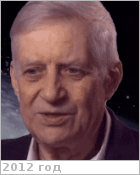
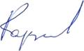

# Кардашёв, Николай Семёнович
> 2019.10.17 **[🚀](../index/index.md) [despace](index.md)** → **[Archive](faq.md)**, [Contact](contact.md)

|*[Org.](contact.md)*|*[АКЦ ФИАН](zz_asc_fian.md), RU. Директор института*|
|:--|:--|
|i18n| Kardashev, Nikolai Semenovich |
|Tel|*раб.:* +7(495)333-21-89; *mobile:* +7(916)127-54-02 |
|E‑mail| <nkardash@asc.rssi.ru> |
|B‑day, addr.| 1932.04.25 ‑ 2019.08.03 (87 лет) / … |
||   |

   - **[Education](edu.md):** Доктор физико‑математических наук.
   - Советский и российский астроном, академик РАН (1994); директор Астрокосмического центра ФИАН (с 1990 года); труды по экспериментальной и теоретической астрофизике, радиоастрономии; лауреат Государственной премии СССР (1980, 1988)
   - **SC/Equip.:** [Спектр‑М](спектр_м.md)
   - <https://ru.wikipedia.org/wiki/Кардашёв,_Николай_Семёнович>
   - <http://www.ras.ru/win/db/show_per.asp?P=.id-287.ln-ru>
