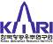

# KARI
> 2020.07.24 [🚀](../index/index.md) [despace](index.md) → [Contact](contact.md)

||<mark>noemail</mark>, 042-860-2114, Fax: …;  *KARI, 169-84, Gwahak-ro, Yusong-gu, Daejeon*  【<http://www.kari.re.kr/> ・ [Wikipedia(EN) ⎆](https://en.wikipedia.org/wiki/Korea_Aerospace_Research_Institute)・ [LinkedIn ⎆](https://www.linkedin.com/company/kari/)】|
|:--|:--|
|**Mission**|…|
|**Vision**|…|
|**Values**|…|
|**Business**|…|
|**[MGMT](mgmt.md)**|…|

The **Korea Aerospace Research Institute (KARI)** established 1989.10.10, is the aeronautics & space agency of South Korea.

Its main laboratories are located in Daejeon, in the Daedeok Science Town. KARI's vision is to continue building upon indigenous launch capabilities, strengthen national safety & public service, industrialize satellite information & applications technology, explore the moon, & develop environmentally‑friendly & highly‑efficient cutting‑edge aircraft & core aerospace technology. Current projects include the KSLV-2 launcher. Past projects include the 1999 Arirang-1 satellite. The agency was founded in 1989. Prior to South Korea’s entry into the IAE in 1992, it focused primarily on aerospace technology.

Mission & Major Functions

   1. Perform basic & applied studies in aerospace technology
      - Development of leading‑edge technology aircraft, aircraft evaluation & testing, & support of national development projects
      - Research & development of comprehensive system & core technology of aircraft, [satellite](sc.md), & [space launch vehicle](lv.md)
      - Support national aerospace development policy establishment, distribution, & diffusion of aerospace technology information
      - Development & KSLV (Korea Launching of Space Launch Vehicles) & Operation of Space Center
   1. Perform government‑delegated tasks & support policy development
      - Development of technology for assuring aerospace safety & quality, & maintenance of legal quality certification & internationally recognized certification systems
      - Establishment & support of the National Aerospace Development Policy & dissemination of knowledge on aerospace technology
   1. Support industries & transfer technology
      - Joint utilization of testing facilities & equipment with industries & academia, & training of scientists & engineers
      - Transfer of technology from research & development & provisions for commercialization support

 

KARI began in 1989 to develop its own rockets. It produced the KSR-I & KSR-II, one & two‑stage rockets in the early 1990s.

KARI is also developing Unmanned Aerial Vehicles, high‑altitude airships, a next‑generation multi‑purpose helicopter project, next‑generation medium satellite, & a lunar exploration project. In addition, several satellites, including the KOMPSAT (also known as Arirang) Series, the COMS (Communication, Ocean & Meteorological Satellite), & the STSAT (Science & Technology Satellite), are developed, operated, or under development by KARI. On 2013.01.30 they launched a satellite into space from their own soil for the first time.

**Korean Lunar Exploration Program.** 2016.12 KARI signed a lunar exploration technical cooperation with NASA which increased the possibility of exploration success greatly. The Korean Lunar Exploration Program (KLEP) is divided in 2 phases. Phase 1 incorporates the launch & operation of a lunar orbiter called Korea Pathfinder Lunar Orbiter (KPLO), which will be the first lunar probe by South Korea, meant to develop & enhance South Korea’s technological capabilities, as well as map natural resources from orbit. Phase 2 will include a lunar obiter, a lander, & a rover to be launched together on a KSLV-II from the [Naro Space Center](naro.md), by 2030.
