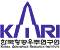

# KARI
> 2019.08.05 **[🚀](../index/index.md) [despace](index.md)** → [Contact](contact.md)

||*…*|
|:--|:--|
|E‑mail| <mark>noemail</mark> |
|Link| <http://www.kari.re.kr/>  <https://en.wikipedia.org/wiki/Korea_Aerospace_Research_Institute>  <https://ru.wikipedia.org/wiki/Корейский_институт_аэрокосмических_разработок>  <https://www.linkedin.com/company/kari/> |
|Tel| <mark>noworkphone</mark>, fax: … |

**Корейский институт аэрокосмических разработок** *(англ. Korea Aerospace Research Institute, KARI, 한국항공우주연구원)* — агентство по космосу и аэронавтике Республики Корея. Является основным институтом Южной Кореи в области освоения космоса. Его основные лаборатории расположены в городе Тэджон. Наиболее значимым результатом следует считать разработку спутника Ариран‑1. Основной целью на текущем этапе является разработка и совершенствование ракеты‑носителя KSLV. При вступлении Республики Корея в IAE в 1992 году агентство занялось аэрокосмическими технологиями. Основан 10 октября 1989 года.

Играет важную роль в отрасли. Институт является собственностью государства, с этим связан его особый статус. Институт является частью Агентства по аэронавтике и космосу Республики Корея. Институт был основан в 1989 году, с 1999 года сотрудничает в исследованиях космоса с Корейской аэрокосмической корпорацией (KAI), которая занимается гражданским и военным авиастроением, разработкой и созданием спутников. Первоначально разработки в космической сфере являлись ответом на аналогичные в КНДР и проходили при технической поддержке США. В 2004 году подписано соглашение о сотрудничестве также и с российской стороной. Исследовательские лаборатории расположены в городе Тэджон, а именно — в специализированном научном городке Тэдок. Основной заказчик проектов — государство. Одним из проектов является разработка средств доставки спутников на околоземную орбиту — ракет‑носителей. Институт обслуживает первый космодром Южной Кореи. Из последних проектов можно отметить проект создания спутника Ариран‑1, а также разработки ракеты‑носителя KSLV‑1. 3 сентября 2016 года на ВЭФ‑2016 во Владивостоке Госкорпорация «РОСКОСМОС» и Корейский институт космических исследований (КАРИ) подписали Меморандум о взаимопонимании по активизации двустороннего сотрудничества в космической сфере.

 

## KARI, comments

**Ракеты‑носители**

   - KSLV‑1 или проект Наро — завершившийся проект института по созданию и совершенствованию двухступенчатой ракеты‑носителя. Первая ступень — российская (на базе ракеты «Ангара»), вторая — южнокорейская. Первый пуск состоялся в 2009 году, второй — в 2010 году. Оба запуска оказались неудачными. Третий запуск ракеты‑носителя «KSLV‑1» был намечен на осень 2012 года, но был перенесён и состоялся 30 января 2013 года, что дало возможность КНДР опередить Южную Корею и стать 10‑й космической державой 12 декабря 2012 года. Это был последний запуск в рамках проекта KSLV‑1.
   - KSLV‑2 — перспективный проект создания следующей в семействе ракеты‑носителя, имеющей обе ступени национальной разработки.

**Космодром.** Для запуска собственных ракет‑носителей в стране к 2009 году был сооружён космодром «Космический центр Наро», расположенный на острове Венародо в провинции Чолла‑Намдо на юго‑западе Корейского полуострова.

**Пилотируемая космонавтика**

   - Южной Кореей была предпринята разовая национальная программа «Корейский астронавт». По программе были подготовлены два корейских астронавта и Ли Со Ён отправилась на Международную космическую станцию на российском корабле «Союз ТМА‑12» 8 апреля 2008 года. По имеющимся сведениям, программа обошлась стране в $ 20 млн.
   - Неоднократно заявлялось, что в перспективе страна намерена организовать собственными силами национальную пилотируемая космонавтику, для чего предполагается создать центр подготовки астронавтов и разработать после KSL‑2 более мощную ракету‑носитель.

**Аэрокосмические исследования.** При поддержке института разработаны спутники Ариран, COMS и STSAT. Также в институте ведутся разработки беспилотных летательных аппаратов, многоцелевых вертолётов и высотных дирижаблей.
