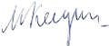

# Келдыш, Мстислав Всеволодович
> 2019.11.17 **[🚀](../index/index.md) [despace](index.md)** → [Contact](contact.md)

|*[Org.](contact.md)*|*АН СССР, SU.*|
|:--|:--|
|i18n| Keldysh, Mstislav Vsevolodovich |
|Tel| |
|E‑mail| |
|B‑day, addr.| 1911.02.10 ‑ 1978.06.24 / Москва, СССР |
||   |

   - **[Education](edu.md):** Академик АН СССР (1946; член‑корреспондент 1943). Трижды Герой Социалистического Труда (1956, 1961, 1971). Лауреат Ленинской премии (1957) и двух Сталинских премий (1942, 1946). Член КПСС с 1949. Член ЦК КПСС (1961 ‑ 1978).
   - **Exp.:** …
   - Учёный в области прикладной математики и механики, крупный организатор советской науки, один из идеологов советской космической программы. Президент Академии наук СССР (1961 ‑ 1975).
   - **SC/Equip.:** …
   - **Conferences:** …
   - Git: …
   - Facebook: 
   - Instagram: 
   - LinkedIn: 
   - Twitter: 
   - <https://ru.wikipedia.org/wiki/Келдыш,_Мстислав_Всеволодович>
