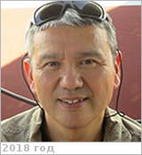

# Komatsu, Goro
> 2019.10.20 [🚀](../index/index.md) [despace](index.md) → [Contact](contact.md)

|*[Org.](contact.md)*|*[IRSPS](zz_irsps.md), EU. Dipartimento di Ingegneria e Geologia (InGeo). Senior Scientist*|
|:--|:--|
|B‑day, addr.|<mark>nodate</mark> 1966  / …|
|Contact|<goro@irsps.unich.it>, <goro.komatsu@unich.it>, *work:* +39(085)453-78-84; *mobile:* <mark>nomobile</mark>|
|i18n|<mark>TBD</mark>|
|| <mark>nosign</mark> |

   - **[Education](edu.md):**  PhD, Planetary Sciences, University of Arizona, Tucson, Arizona, US, 1993. BS, Earth Sciences, Waseda University, Tokyo, Japan, 1988.
   - **Exp.:** Geological Institute, University of Tokyo, Japan. School of Sciences & Applications, International Space University, Strasbourg, France. Lunar & Planetary Laboratory, University of Arizona, U.S.A.
   - My major research focus is surface landforms of terrestrial planets. I am interested in their formation processes & implications for the evolution of the planets. I studied channels & valleys on Venus. These enigmatic features were perhaps produced by actions of low viscosity lavas. For Mars, I am interested in processes of water, including oceans, outflow channels, valley networks, layered deposits, glaciation, & sedimentation. For Earth, I have been involved in cataclysmic flood research projects in northern Alaska & Central Asia, drainage evolution studies in northern Eurasia, Central Australia, & Central Mexico, & investigation of a possible impact crater in Mongolia. I also conducted a study of a paleolake system in the Gobi desert in order to reconstruct paleoenvironments in which paleolithic humans migrated & settled.
   - **SC/Equip.:** … [EnVision](envision.md)
   - **Conferences:** …
   - Git: …
   - Facebook: <mark>nofb</mark>
   - Instagram: <mark>noin</mark>
   - LinkedIn: <mark>noli</mark>
   - Twitter: <mark>notw</mark>
   - <https://www.irsps.it/goro-komatsu.html>
   - <https://scholar.google.com/citations?:user=GFMhh64AAAAJ&hl=en>
   - <https://www.researchgate.net/profile/Goro_Komatsu>
   - **As a person:**
      1. …
