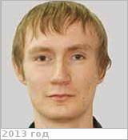

# Комбаев, Тимур Шикурович
> 2019.12.05 ┊ **[🚀](../index/index.md) [despace](index.md)** → **[Contact](contact.md)**

|*[Org.](contact.md)*|*НПОЛ, RU. КЛГ / 801, 509, «Филиал Калуга». Инженер‑конструктор 2‑й категории*|
|:--|:--|
|i18n| <mark>TBD</mark> |
|Tel| *work:* Калуга: 154; 36-15, 56-15 — если он в Химках; *mobile:* +7(930)753-01-14, +7(910)512-69-32 |
|E‑mail| <kombaev@laspace.ru> |
|B‑day, addr.| <mark>nodate</mark> / … |
||  <mark>nosign</mark>  |

   - **[Education](edu.md):** …
   - **Exp.:** …
   - Участвовал в финансировании книги Шубина «[Венера — неукротимая планета](book_shubin_veneranp.md)».
   - **SC/Equip.:** …
   - **Conferences:** …
   - Git: …
   - Facebook: <mark>nofb</mark>
   - Instagram: <https://instagram.com/kombaew>
   - LinkedIn: <mark>noli</mark>
   - Twitter: <https://twitter.com/kombaew>
   - <https://vk.com/planktos>
   - <https://ok.ru/profile/12784645777>
   - <https://mai.ru/content/people/index.php?ID=41769>
   - **As a person:**
      1. …
