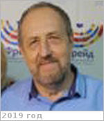

# Компаниченко, Владимир Николаевич
> 2019.07.18 **[🚀](../index/index.md) [despace](index.md)** → [Contact](contact.md)

|*[Org.](contact.md)*|*ИКАРП, RU. Лаборатория эволюции, генетики и экологии. Ведущий научный сотрудник*|
|:--|:--|
|i18n| <mark>TBD</mark> |
|Tel|*раб.:* +7(426)226-13-62; *mobile:* <mark>nomobile</mark> |
|E‑mail| <kompanv@yandex.ru> |
|B‑day, addr.| <mark>nodate</mark> 1950 / … |
||  <mark>nosign</mark> |

   - **[Education](edu.md):** Кандидат геолого‑минералогических наук, Дальневосточный геологический институт, Владивосток, 1983. Междисциплинарные исследования живых систем в контексте астробиологии, включая формулирование их принципиальных характеристик и обоснование механизмов их первоначального возникновения в геологической среде.
   - **Exp.:** …
   - …
   - **SC/Equip.:** …
   - **Conferences:** [2019 VD Workshop](vdws2019.md)
   - Git: …
   - Facebook: <mark>nofb</mark>
   - Instagram: <mark>noin</mark>
   - LinkedIn: <mark>noli</mark>
   - Twitter: <mark>notw</mark>
   - <http://икарп.рф/laboratorii/genetika/kompanichenko.php>
   - **As a person:**
      1. …
