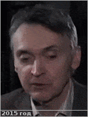
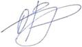

# Кораблёв, Олег Игоревич
> 2019.04.01 [🚀](../index/index.md) [despace](index.md) → [Contact](contact.md)

|*[Org.](contact.md)*|*[ИКИ РАН](zz_iki_ras.md), RU. Отдел №53 «Физики планет и малых тел солнечной системы». Заведующий отделом, зам. директора ИКИ РАН*|
|:--|:--|
|B‑day, addr.|<mark>nodate</mark> / …|
|Contact|<korab@iki.rssi.ru>, *раб.:* +7(495)333-00-17; *mobile:* +7(903)961-76-27|
|i18n|Korablev, Oleg Igorevich|
| | |

   - **[Education](edu.md):** …
   - **Exp.:** Skills & Expertise: Spectra, Spectrometers, Experimental Physics, Remote Sensing, Optics, Astronomy & Astrophysics, Atmosphere, Atmospheric Physics, Climatology, Geophysics.
   - …
   - **SC/Equip.:** Луна‑26 (ЛУМИС, ЛЭВУС)
   - **Conferences:** 2019 [MSSS 10](msss_10.md)
   - Git: …
   - Facebook: <mark>nofb</mark>
   - Instagram: <mark>noin</mark>
   - LinkedIn: <mark>noli</mark>
   - Twitter: <mark>notw</mark>
   - <http://www.planetary-department-iki.ru/people.html>
   - <https://www.researchgate.net/profile/O_Korablev>
   - **As a person:**
      1. …
