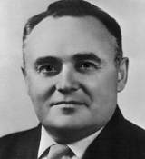
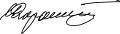

# Королёв, Сергей Павлович
> 2019.11.17 ┊ **[🚀](../index/index.md) [despace](index.md)** → [Contact](contact.md)

|*[Org.](contact.md)*|*ОКБ-1, SU.*|
|:--|:--|
|i18n| Korolev, Sergei Pavlovich |
|Tel| |
|E‑mail| |
|B‑day, addr.| 1907.01.12 ‑ 1966.01.14 / Москва, СССР |
||   |

   - **[Education](edu.md):** …
   - **Exp.:** …
   - Учёный, конструктор ракетно‑космических систем, председатель Совета главных конструкторов СССР (1950 ‑ 1966). Академик АН СССР (1958). Является одним из основных создателей советской ракетно‑космической техники, обеспечившей стратегический паритет и сделавшей СССР передовой ракетно‑космической державой, и ключевой фигурой в освоении человеком космоса, основателем практической космонавтики. Под его руководством был организован и осуществлён запуск первого искусственного спутника Земли и первого космонавта планеты Юрия Гагарина.
   - **SC/Equip.:** …
   - **Conferences:** …
   - Git: …
   - Facebook: 
   - Instagram: 
   - LinkedIn: 
   - Twitter: 
   - <https://ru.wikipedia.org/wiki/Королёв,_Сергей_Павлович>
