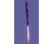

# Laboratory of Space Systems
> 2020.07.15 **[🚀](../index/index.md) [despace](index.md)** → [Contact](contact.md)

||*Nishi8-Chome, Kita13-jo, Kita-ku, Sapporo-shi, Hokkaido 060-8628, Japan*|
|:--|:--|
|E‑mail|<spacesystem@mech-hm.eng.hokudai.ac.jp>|
|Link|<https://mech-hm.eng.hokudai.ac.jp/~spacesystem/index_e.html>|
|Tel|<mark>noworkphone</mark>, ℻: …|

**Laboratory of Space Systems** is a division of Mechanical & Space Engineering, Graduate School of Engineering, Hokkaido University, Japan.

Projects:

   - CAMUI Hybrid Rocket Engine
   - Liquid Droplet Radiator
   - Pulse Detonation Engine
   - SOTV (The solar orbit transfer vehicle)
   - The staged combustion hybrid rocket

 

## Laboratory of Space Systems, comments

…

