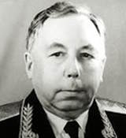

# Лавочкин, Семён Алексеевич
> 2019.11.17 **[🚀](../index/index.md) [despace](index.md)** → [Contact](contact.md)

|*[Org.](contact.md)*|*ОКБ-301, SU.*|
|:--|:--|
|i18n| Lavochkin, Semyon Alekseyevich |
|Tel| |
|E‑mail| |
|B‑day, addr.| 1900.09.11 ‑ 1960.06.06 СССР / Химки, СССР |
||  |

   - **[Education](edu.md):** …
   - **Exp.:** В 1939 ‑ 1940 гг под руководством В.П. Горбунова в ОКБ‑301 (г. Химки Московской области) был одним из инициаторов и участников создания советского самолёта‑истребителя ЛаГГ‑3 из дельта‑древесины. Вместе с Горбуновым и Гудковым в 1939 г получил звание — главный конструктор по самолётостроению. Ряд последующих моделей — Ла‑5, Ла‑7 и различные их модификации, созданные уже в ОКБ‑21 под руководством Лавочкина в городе Горьком (назначен начальником ОКБ 1940.11.23), обнаружили высокие боевые качества и сыграли важную роль в ходе Великой Отечественной войны. В октябре 1945 г после возвращения из города Горького назначен начальником ОКБ‑301 (ныне АО «Научно‑производственное объединение им. С. А. Лавочкина»). После войны Лавочкин работал над созданием реактивных самолётов. В ОКБ‑301 были разработаны серийный (Ла‑15) и многие опытные реактивные истребители. В 1954 г начинает работу над межконтинентальной сверхзвуковой крылатой ракетой «Буря» (руководитель работ — Н.С. Черняков). В 1956 году присвоено звание — Генеральный конструктор по самолётостроению. С 1944 г Лавочкин — генерал‑майор инженерно‑технической службы, с 1958 г — член‑корреспондент АН СССР. Депутат ВС СССР 3 ‑ 5 созывов (1950 ‑ 1958), член КПСС с 1953 г.
   - Советский авиационный конструктор, генерал‑майор, дважды Герой Социалистического Труда, лауреат четырёх Сталинских премий.
   - **SC/Equip.:** Самолёты Ла‑5, Ла‑7, Ла‑ВРД, Ла‑9, Ла‑11, Ла‑15, Ла‑150, Ла‑152, Ла‑156, Ла‑160, Ла‑168, Ла‑174ТК, ЛА-176, Ла‑190, Ла‑200, Ла‑250, ЛаГГ-1, ЛаГГ-3.
   - **Конференции:**
   - Git: …
   - Facebook:
   - Instagram:
   - LinkedIn:
   - Twitter:
   - <https://ru.wikipedia.org/wiki/Лавочкин,_Семён_Алексеевич>
