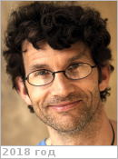

# Lebonnois, Sebastien
> 2019.07.09 **[🚀](../index/index.md) [despace](index.md)** → [Contact](contact.md)

|*[Org.](contact.md)*|*[Sorbonne Univ.](sorbonne_univ.md)/[LMD](lmd.md), EU. Directeur de Recherche (CNRS senior scientist)*|
|:--|:--|
|i18n|<mark>TBD</mark>|
|Tel|*раб.:* +33(0)144-272-314; *mobile:* <mark>nomobile</mark>|
|E‑mail|<sebastien.lebonnois@lmd.jussieu.fr>|
|B‑day, addr.|<mark>nodate</mark> 1973.. / …|
|| <mark>nosign</mark>|

   - **[Education](edu.md):** PhD, planetary sciences, 'Centre d'Etude Spatiale des Rayonnements' (CNRS/Univ. Toulouse Ⅲ, France), 2000.
   - **Exp.:** CNRS researcher in the planetary science team at Laboratoire de Meteorologie Dynamique. My current research focuses on the atmospheres of Venus & Titan. I develop general circulation models, especially photochemical aspects, & couplings. Goal is to build Global Climate Models, useful tools for the interpretation of space missions' data. I was involved in the Venus-Express mission (VIRTIS et SPICAV instruments), & participate to various projects to go back to Venus. I have also done some work on Mars atmosphere, especially studying ozone distribution with data from the SPICAM instrument on-board Mars-Express.
   - …
   - **SC/Equip.:** …
   - **Conferences:** 2019 [IVC](ivc_2019.md)
   - Git: …
   - Facebook: <mark>nofb</mark>
   - Instagram: <mark>noin</mark>
   - LinkedIn: <mark>noli</mark>
   - Twitter: <mark>notw</mark>
   - <http://www.lmd.jussieu.fr/~sllmd/index.html>
   - **As a person:**
      1. …
