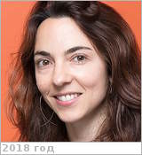

# Le Gall, Alice Anne
> 2019.10.21 ┊ **🚀 [despace](index.md)** → **[Contact](contact.md)**

|*[Org.](contact.md)*|*[LATMOS](zz_latmos.md), EU(FR). Associate Professor*|
|:--|:--|
|i18n| <mark>TBD</mark> |
|Tel| *раб.:* +33(1)80-28-52-35, +33(1)44-27-21-63; *моб.:* <mark>нетмобильного</mark> |
|E‑mail| <alice.legall@latmos.ipsl.fr>, <alice.le-gall-gilabert@uvsq.fr> |
|B‑day, addr.| <mark>нетдаты</mark> 1982 ? / … |
||  <mark>нетподписи</mark>  |

   - **[Education](edu.md):** Depuis, Maître de Conférences, LATMOS, UVSQ, Chaire CNES/UVSQ, 2011. PostDoc, NASA, JPL, Caltech, 2011. PhD, CETP, Paris VI, 2007. MS, d’Astrophysique, Observatoire de Paris-Meudon, Paris VII, 2004. Ecole Supérieure d’Electricité (SUPELEC), Gif-sur-Yvette, 2003.
   - **Exp.:** Alice Le Gall received the degree in radio-communication & electronic engineering from the Ecole Supérieure d'Electricité (SUPELEC), Gif-sur-Yvette, France, in 2003 & the Ph.D. degree in astrophysics from the University of Paris 6, Paris, France, in 2007.,For three years, she was a NASA Postdoctoral Fellow at the JPL, Pasadena, CA, USA. In 2011, she became an Associate Professor at Laboratoire ATmosphère, Milieux, Observations Spatiales-Université de Versailles Saint-Quentin-en-Yvelines (LATMOS-UVSQ), Guyancourt, France, with a chair UVSQ-CNES (French Space Agency).
   -  Her field of interest includes remote sensing observation of planetary surfaces & subsurfaces by electromagnetic techniques.,Dr. Gall is presently the CoI on the WISDOM GPR experiment on the 2018 ExoMars Mission & on Permittivity Probe (PP) instrument on board the Philae lander of the ROSETTA mission (PP-SESAME/Philae/ROSETTA) & an Associate Member of the Cassini radar Team.
   - **SC/Equip.:** … [EnVision](envision.md)
   - **Conferences:** …
   - Git: …
   - Facebook: <https://www.facebook.com/alice.legall>
   - Instagram: <mark>нетинсты</mark>
   - LinkedIn: <mark>нетин</mark>
   - Twitter: <mark>неттви</mark>
   - <http://www.ovsq.uvsq.fr/equipe-pedagogique/le-gall-alice--326525.kjsp>
   - <https://www.iau.org/administration/membership/individual/18259/>
   - <http://www.cnrs.fr/fr/personne/alice-le-gall>
   - <http://www.latmos.ipsl.fr/index.php/fr/annuaire?task=view&id=3723>
   - <https://ieeexplore.ieee.org/author/38071751800>
   - **As a person:**
      1. …
