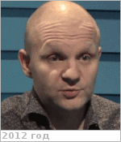
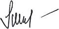

# Литвак, Максим Леонидович
> 2019.04.01 ┊ **🚀 [despace](index.md)** → **[Contact](contact.md)**

|*[Org.](contact.md)*|*[ИКИ РАН](zz_iki_ras.md), RU. Отдел № 63 «Ядерной планетологии». Лаборатория № 631 «Нейтронной и гамма‑спектроскопии». Заведующий лабораторией*|
|:--|:--|
|i18n| <mark>TBD</mark> |
|Tel|*раб.:* +7(495)333-15-22; *моб.:* +7(968)666-24-36 |
|E‑mail| <mlitvak.iki@gmail.com> |
|B‑day, addr.| <mark>нетдаты</mark> / … |
||   |

   - **[Education](edu.md):** Д.ф.м.н.
   - **Exp.:** …
   - …
   - **SC/Equip.:** …
   - **Conferences:** …
   - Git: …
   - Facebook: <mark>нетфб</mark>
   - Instagram: <mark>нетинсты</mark>
   - LinkedIn: <mark>нетин</mark>
   - Twitter: <mark>неттви</mark>
   - <http://l503.iki.rssi.ru/people.html>
   - **As a person:**
      1. …
