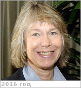

# Luhmann, Janet G.
> 2019.04.01 ┊ **🚀 [despace](index.md)** → **[Contact](contact.md)**

|*[Org.](contact.md)*|*[NASA](zz_nasa.md), US. Space Sciences Laboratory, California Univ., Berkeley. Senior Space Fellow*|
|:--|:--|
|i18n| <mark>TBD</mark> |
|Tel|*раб.:* <mark>noworkphone</mark>; *моб.:* <mark>нетмобильного</mark> |
|E‑mail| <jgluhman@ssl.berkeley.edu> |
|B‑day, addr.| <mark>нетдаты</mark> 1946 / … |
||  <mark>нетподписи</mark> |

   - **[Education](edu.md):** Heliospheric & Planetary Physics. Her work focuses on the use of spacecraft observations & models to investigate the connections between the Sun & heliospheric conditions, & on the solar wind interactions with the planets.
   - **Exp.:** …
   - Janet G. Luhmann (born 1946) is an American physicist and senior fellow of the Space Sciences Laboratory of the University of California, Berkeley. She has made major contributions to a wide range of topics in planetary, solar, magnetospheric, and heliospheric physics. She is the principal investigator of the IMPACT instrument suite on the twin-spacecraft STEREO mission. IMPACT stands for In-situ Measurements of Particles and Coronal mass ejection (CME) Transients. It consists of a, "suite of seven instruments that samples the 3-D distribution of solar wind plasma electrons, the characteristics of the solar energetic particle (SEP) ions and electrons, and the local vector magnetic field."
   - **SC/Equip.:** …
   - **Conferences:** …
   - Git: …
   - Facebook: <mark>нетфб</mark>
   - Instagram: <mark>нетинсты</mark>
   - LinkedIn: <mark>нетин</mark>
   - Twitter: <mark>неттви</mark>
   - <https://en.wikipedia.org/wiki/Janet_Luhmann>
   - <https://science.nasa.gov/science-committee/members/dr-janet-g-luhmann>
   - <http://sprg.ssl.berkeley.edu/scientistslinks/luhmannj_home.html>
   - <http://venus.wisc.edu/mission_participants.html>
   - <https://www.researchgate.net/scientific-contributions/2013649891_JANET_G_LUHMANN>
   - **As a person:**
      1. …
