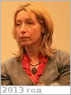

# Maroko, Elena Vladimirovna
> 2019.04.01 ┊ **🚀 [despace](index.md)** → **[Contact](contact.md)**

|*[Org.](contact.md)*|*[NASA](zz_nasa.md), RU. Специалист по аэрокосмическим вопросам московского офиса НАСА*|
|:--|:--|
|i18n| <mark>TBD</mark> |
|Tel|*раб.:* <mark>нетрабочего</mark>; *моб.:* <mark>нетмобильного</mark> |
|E‑mail| <mark>нетпочты</mark> |
|B‑day, addr.| 1960.05.15 (Москва, РФ) / … |
||  <mark>нетподписи</mark> |

   - **[Education](edu.md):** …
   - **Exp.:** …
   - **SC/Equip.:** …
   - **Conferences:** 2019 [MSSS 10](msss_10.md), 2019 [VD Workshop 2019](vdws2019.md)
   - Git: …
   - Facebook: <https://www.facebook.com/elena.maroko.5>
   - Instagram: <https://instagram.com/elena.maroko>
   - LinkedIn: <mark>нетин</mark>
   - Twitter: <mark>неттви</mark>
   - **As a person:**
      1. …
