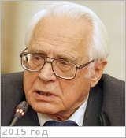

# Маров, Михаил Яковлевич
> 2019.10.12 ┊ **🚀 [despace](index.md)** → **[Contact](contact.md)**

|*[Org.](contact.md)*|*[ИПМ Келдыша](zz_keldysh_ipm.md), RU. Профессор*|
|:--|:--|
|i18n| <mark>TBD</mark> |
|Tel| *раб.:* <mark>нетрабочего</mark>; *моб.:* <mark>нетмобильного</mark> |
|E‑mail| <mark>нетпочты</mark> |
|B‑day, addr.| 1933.07.28 Москва, СССР / … |
||  <mark>нетподписи</mark>  |

   - **[Education](edu.md):** Академик РАН (2008). Член‑корреспондент АН СССР (1990). Доктор физико‑математических наук (1970). Основные труды в области экспериментальной планетной астрономии, структуры, динамики, оптических характеристик и теплового режима планетных атмосфер. Один из инициаторов и научных руководителей программы исследования Венеры с помощью АКА СССР серии «Венера». Принимал участие в осуществлении первых прямых измерений параметров атмосферы, температуры и давления у поверхности Венеры. Изучал термодинамическое состояние газа в атмосфере Венеры и выявил ряд важных динамических характеристик, связанных с проблемами теплообмена и планетарной циркуляции. Был участником эксперимента на АКА «Марс‑6», на котором проведены первые прямые измерения параметров атмосферы Марса. В области физики верхней атмосферы (аэрономии) выполнил обширный цикл исследований по изучению структуры и динамики земной термосферы, где выявлен ряд новых эффектов и получены их количественные оценки. Предложил оригинальные подходы к моделированию структуры и физико‑химических процессов в верхних атмосферах планет с использованием методов многокомпонентной радиационной гидродинамики и химической кинетики, а также к изучению неравновесных элементарных процессов с использованием статистических методов в решении кинетических уравнений. Активно участвовал в программе СССР «Интеркосмос».
   - **Exp.:** …
   - Советский и российский астроном.
   - **SC/Equip.:** 2007 [Venus Flagship Mission](venus_flagship_mission.md), 1970 [Венера‑7](venera_7.md)
   - **Conferences:** [2019 MSSS](msss_10.md)
   - Git: …
   - Facebook: <https://www.facebook.com/profile.php?id=100009896565104>
   - Instagram: <mark>нетинсты</mark>
   - LinkedIn: <mark>нетин</mark>
   - Twitter: <mark>неттви</mark>
   - **As a person:**
      1. …
